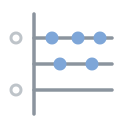
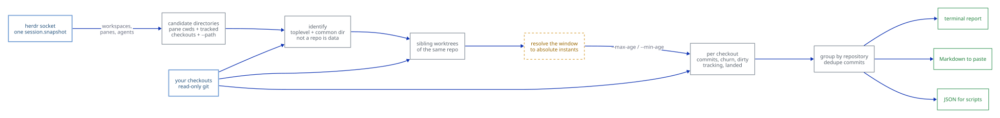

<div align="center">



# standup

**A digest of what your agents actually did. One command, one readable summary of every workspace
over a time window — commits, change volume, branch, and whether the work landed anywhere.**

[](https://github.com/moneycaringcoder/herdr-standup/actions/workflows/ci.yml)
[](LICENSE)
[](https://herdr.dev)
[](#it-never-writes-to-your-repositories)

</div>

```
standup — since 2026-08-15 00:00 UTC +0000 (generated 23:15)

  6 commits  ·  5 files  +11 −1  across 4 repositories

  lanternfish                                      6 commits  ·  5 files  +11 −1
    wip/salvage                 ~/code/lanternfish/wt-salvage
      ! the branch wip/salvage was deleted underneath this checkout
      no commits in this window, merge status unknown: HEAD has no commit, so
        nothing can have landed on origin/main, no branch to track
      uncommitted: 4 files changed, 1 untracked, +6 −0
    fix/media-fetch-throughput  ~/code/lanternfish/wt-throughput
      agents: kestrel (opencode), wren (claude)
      4 commits, 4 files, +10 −1, not merged into origin/main, in sync with
        origin/fix/media-fetch-thro…
      uncommitted: 1 file changed, 1 untracked, +1 −0
        09:04  2eccdd14  Batch media fetches behind a semaphore
        08:31  9c4fdd36  Add a throughput regression test
        07:58  da24c3f2  Drop the per-item retry loop
        06:12  6952a747  Bump the media timeout to 30s
    main                        ~/code/lanternfish
      authors: Ada Bexley
      3 commits (1 merge), 4 files, +6 −0, on the default branch origin/main, 2
        ahead of origin/main
        06:12  6952a747  Bump the media timeout to 30s
        05:40  30eb8d7f  Merge chore/deps
        05:40  641ab749  Pin serde to 1.x
    spike/av1                   ~/code/lanternfish/wt-spike
      authors: Ada Bexley
      1 commit, 3 files, +5 −0, merged into origin/main, no upstream
        06:12  6952a747  Bump the media timeout to 30s

  quiet: brambleway, quillmark, tidepool
```

Four things in that screen are the reason the plugin exists. `wip/salvage` has a
branch that was **deleted underneath a live checkout**, with six lines of
uncommitted work still in it. `fix/media-fetch-throughput` is **in sync with its
own remote and still not merged** into the trunk — published, not landed.
`spike/av1` **has landed** and is safe to remove. And three repositories were
**quiet**, which is stated rather than left to inference.

## Why

After a day of running several agents across several worktrees, working out what came out of it means
visiting each workspace and running `git log` by hand — and the branches you most need to check are
the ones whose workspace you already closed.

`standup` answers it in one command. It asks herdr where the agents are, asks git what happened
there, and prints the result grouped by repository. It reports facts and stops: no pull-request
status, no CI, no generated prose. What the work *meant* is for whoever reads it.

## What it tells you, per checkout

- the commits in the window, with local times
- files touched, lines added and removed — with lockfiles, vendored trees and build output
  excluded from the *line* counts, and the exclusion shown rather than silently applied
- whether it has an upstream, and how far ahead or behind
- **whether the work landed** on the repository's default branch — including under a new sha, which
  is all a squash or a rebase merge leaves behind
- **commits that exist only here** — committed, on no remote, and gone with the directory
- uncommitted work still sitting there, which is the difference between "the agent did nothing" and
  "the agent did a day of work and never committed it"
- which agent was in the workspace, when herdr reports one

Every number is one git command away from being checked by hand, and none of them is a guess.

## Markdown you can paste

`standup --markdown` produces the same digest ready for a standup channel or a commit-day journal.
It is a nested bullet list rather than a table, because a `|` in a branch name breaks a Markdown
table and Slack does not render tables at all:

```markdown
**standup** — since 2026-08-15 00:00 UTC +0000 (generated 23:15)

6 commits, 5 files, +11 −1 across 4 repositories.

- **lanternfish** — 6 commits, 5 files, +11 −1
  - `wip/salvage` — `~/code/lanternfish/wt-salvage` — no commits in this window — merge status unknown: HEAD has no commit, so nothing can have landed on origin/main — no branch to track
    - **problem:** the branch wip/salvage was deleted underneath this checkout
    - uncommitted: 4 files changed, 1 untracked, +6 −0
  - `fix/media-fetch-throughput` — `~/code/lanternfish/wt-throughput` — 4 commits, 4 files, +10 −1 — not merged into origin/main — in sync with origin/fix/media-fetch-throughput
    - agents: kestrel (opencode), wren (claude)
    - `09:04` `2eccdd14` — Batch media fetches behind a semaphore
    - `08:31` `9c4fdd36` — Add a throughput regression test
  - `spike/av1` — `~/code/lanternfish/wt-spike` — 1 commit, 3 files, +5 −0 — merged into origin/main — no upstream
    - `06:12` `6952a747` — Bump the media timeout to 30s

Quiet: brambleway, quillmark, tidepool.
```

Branch names, paths and subjects are escaped or fenced on the way out, so a branch called
`feat/re[factor]` or a commit subject that is itself a Markdown heading still renders.

## JSON for scripting

`standup --json` emits the whole digest with a schema version, so a script can refuse a shape it does
not know. It is the only output that carries an agent's session id — the human and Markdown digests
deliberately leave it out, because they are written to be pasted somewhere shared.

```json
{
  "schema": 1,
  "generated_at": { "epoch": 1786835716, "local": "2026-08-15 23:15", "zone": "UTC +0000" },
  "window": {
    "since": { "epoch": 1786752000, "local": "2026-08-15 00:00", "zone": "UTC +0000" },
    "until": null,
    "source": { "kind": "explicit", "spec": "2026-08-15T00:00:00" }
  },
  "repos": [
    {
      "name": "lanternfish",
      "checkouts": [
        {
          "path": "~/code/lanternfish/wt-salvage",
          "is_linked_worktree": true,
          "head": { "kind": "branch_deleted", "name": "wip/salvage" },
          "commits": [],
          "dirty": { "tracked_changed": 4, "untracked": 1, "conflicted": 0,
                     "insertions": 6, "deletions": 0 }
        }
      ]
    }
  ]
}
```

Every timestamp is an `{epoch, local, zone}` triple, so a script gets the machine value and a human
gets an instant that cannot be misread as UTC.

## Windows

`--since` accepts anything git accepts, and the default is local midnight:

```sh
standup                          # since local midnight
standup --since yesterday
standup --since '3 days ago'
standup --since 2026-08-01 --until 2026-08-08
```

One thing worth knowing, because it catches people: git's date parser reads
`today` as *the current instant*, not as the start of the day. `midnight` is the
spelling that means 00:00 local, and it is the default. `--since today` gets a
warning rather than a blank digest.

`--since-last` is the one that gets used daily. It starts from the last digest you read, so nothing
is counted twice and nothing is missed:

```sh
standup --since-last
```

The marker is recorded by the human-readable and Markdown runs only. A `--json` run is a script
reading, and moving the marker there would silently steal the window out from under your next digest.
The first `--since-last`, with no marker on record, falls back to today's window **and says so** —
"you asked for today" and "this is the first run, so I fell back to today" are different answers to
"why is this empty".

Every window is resolved to an absolute instant before any `git log` runs, and the header states it
in local time with the zone spelled out. That is not decoration:

```
$ git rev-parse --since=bogusgarbage
--max-age=1786831294        # exit 0, and that number is "now"
```

git's date parser answers *now* for anything it cannot understand, with a successful exit status. A
digest built on that is empty, correctly formatted, and a lie. `standup` detects it and refuses.

## Weekly and monthly rollups

```sh
standup --weekly     # this ISO week, Monday to now
standup --monthly    # this calendar month, the 1st to now
```

The window options answer "what happened today". These answer "what happened this month", and the
difference is not only the window: a rollup **aggregates rather than lists**. The commit lines are
gone, the totals stay, and each repository gains the number a long window needs —

```
standup — since 2026-08-01 00:00 UTC +0000 (generated 2026-08-22 11:56)
  window from --monthly: this calendar month, the 1st to now

  58 commits  ·  115 files (2 generated)  +45159 −1318  across 3 repositories

  herdr-redact                37 commits  ·  64 files (1 generated)  +26584 −907
    over 4 active days
```

"37 commits" is a very different month depending on whether it was four days or one, which is why
active days is there and why a daily digest does not print it.

Both boundaries are **calendar**, not rolling: "the last thirty days" is a different question from
"this month", and the second is the one people forward. The week starts on **Monday**, which is ISO
8601's answer rather than the locale's, so the same command means the same window on two machines.
Both are computed from the local zone and printed as an absolute instant on the line above, so the
boundary can be checked rather than trusted — and every number is still one git command away:

```sh
# the active-day count for a repository, by hand
git log --since-as-filter=@1785542400 --date=format-local:%F --format=%cd --all | sort -u | wc -l
```

A rollup sets its own window, so `--since`, `--until` and `--since-last` are refused alongside it by
name rather than one of them quietly winning.

## Diffing two digests

`--since-last` answers "what happened since I last looked". This answers the question after it:

```sh
standup --json > monday.json
# ...on Tuesday
standup --diff monday.json
```

A comparison is **not a longer digest**, and does not read like one. There is no churn here, no line
volume and no commit list — those are what a digest answers. This answers what *moved*:

```
standup — what changed between two digests
  before  2026-08-22 12:17 UTC +0000
  after   2026-08-22 12:41 UTC +0000

  1 new commit across 3 repositories

  herdr-standup
    ~/repos/worktrees/standup-grind
      1 new since

  amadeo
    ~
      ! no new commits, still holding uncommitted work
```

Six things it can say about a checkout:

| reading | what it means |
|---|---|
| `3 new since` | commits the earlier digest did not have, matched by sha |
| `landed since` | reached the trunk — by containment or by patch, so a squash merge counts |
| `pushed since; 2 no longer only here` | reached a remote, which is not the same as reaching the trunk |
| `no new commits, still holding 2 unpushed and uncommitted work` | **stalled** |
| `gone, and was holding 4 that were only there` | the checkout is no longer there, and it took work with it |
| `new here` | not in the earlier digest at all |

The stalled line is the comparison's own finding, and the reason this is worth having: each digest on
its own reports that state plainly, and neither of them says it *has not moved*. Findings a reader
has to act on are marked — `!` in the terminal, bold in Markdown.

Checkouts are matched **by path**, which is the only identity a checkout keeps across two runs:
branches get renamed and `HEAD` moves constantly. Commits are matched by sha, so a rebase between
the two runs reads as new work — which it is, in the sense that matters: those objects were not in
the earlier digest.

Nothing about a comparison touches git. It is a pure function of the two digests, so it says exactly
what they said and cannot quietly consult the disk for a third answer. The saved digest's `schema` is
checked before anything else, and a shape this binary does not know is refused by name rather than
deserialised into something that happens to fit. `--diff` never advances the `--since-last` marker:
what changed between two digests is not "a digest a human read".

## Slack and HTML

```sh
standup --slack     # mrkdwn, for a standup channel
standup --html      # a self-contained document, for an email
```

**Slack's mrkdwn is not Markdown**, and pasting the Markdown digest into Slack degrades in four
specific ways. Each one is what `--slack` exists to avoid:

| Markdown | in Slack |
|---|---|
| `**bold**` | renders literally, asterisks and all — mrkdwn's bold is a *single* asterisk |
| `- item` | renders literally when posted through the API; mrkdwn has no list syntax at all |
| `[text](url)` | renders literally; mrkdwn links are `<url\|text>` |
| `&`, `<`, `>` | interpreted, so they have to arrive as `&amp;`, `&lt;`, `&gt;` |

So `--slack` bolds with one asterisk, draws bullets with literal `•` and `◦` characters, and escapes
exactly those three entities — and **only** those three. mrkdwn has no escape character, so putting
a backslash in front of ordinary punctuation the way the Markdown renderer does would show the
backslash in the channel. A branch called `feat/re[factor]` arrives with its brackets intact.

`--html` is written for the least capable renderer it will meet, which for HTML means an email
client:

- **every style is inline** — Gmail and Outlook strip `<style>` blocks and `<link>` outright, so a
  stylesheet is one that will not arrive;
- **nothing to fetch** — no images, no fonts, no scripts, since remote content is blocked by default
  and a blocked resource is worse than an absent one;
- **layout by table**, which is the one thing Outlook renders predictably;
- `&`, `<`, `>` and `"` always escaped — a branch called `feat/<x>` must not become a tag, and a path
  interpolated into a `style` attribute must not end it.

Both carry the same numbers as the other formats. That is asserted rather than assumed: the totals,
the churn, the uncommitted counts and the unpushed count are extracted from all four renderings and
compared, because **a format is a rendering and never a different answer**.

## Grouping by agent

```sh
standup --by-agent
```

"What did shear-classifier do this week." Opt-in, and it will stay opt-in, for two reasons that the
digest states above the first group rather than leaving you to find out:

**It interleaves unrelated projects.** Grouping by repository is deliberate — grouping by time would
put two commits from one branch on opposite sides of an unrelated project's commit, and one agent's
work is spread across repositories, so agent grouping has the same hazard from the other direction.

**The totals stop adding up, and it says by how much.** A commit cannot be split between two agents,
because agents are placed per *checkout* and a commit's author identity is shared by every agent on
the machine — three agents, one author identity is the normal shape. So a commit that reaches two
groups is counted in both, and there are two ways for that to happen: two agents sharing one
checkout, and two checkouts of one repository landing in different groups, since worktrees share
history. The second needs only one agent per checkout, which is the ordinary case, and it is why the
difference is **measured against the digest's own total** rather than described:

```text
grouped by agent, which interleaves unrelated projects — the default grouping is by repository.
These totals add up to 53 commits more than the digest's, because a commit cannot be split between
two agents sharing a checkout, or between two checkouts of one repository in different groups, so it
is counted in each
```

Each group's numbers are recomputed over exactly the checkouts that agent occupied, by the same union
rule the ungrouped digest uses — never inherited from the repository, which would credit an agent
with a sibling worktree's work. Work herdr could not attribute is reported under `no agent reported`
rather than dropped, and never guessed at.

`--json` is unchanged by the flag. It is a documented shape with a schema version, and a second
arrangement of the same repositories wearing the same version is how a consumer gets quietly broken.

## Running it from cron or CI

```sh
standup --slack --fail-if-empty && post-to-channel
```

`--fail-if-empty` exits **2** when there is nothing to report, so a scheduled job can decline to post
rather than sending an empty message. The digest still prints: the status is for the caller, and
swallowing the output would remove the one thing that explains a failed run to whoever reads the cron
mail.

**2, not 1.** A run that fails already exits 1, and a caller that cannot tell the two apart will
either stay silent on the day something breaks or page somebody about a quiet Sunday:

| status | meaning |
|---|---|
| `0` | there is something to report |
| `2` | nothing to report |
| `1` | the run failed — a bad window, an unreadable config, a git binary that could not be run |

**"Nothing" is wider than "no commits."** Uncommitted work, an untracked file, a commit that exists
only here, a branch deleted under a live checkout, a count that could not be read — none of those are
silence, and all of them exit 0. They are the cases most worth posting. What exits 2 is a window in
which every repository is quiet and nothing is at risk.

With `--diff`, the comparison is what would be posted, so that is what "empty" describes: a
comparison where nothing moved exits 2 even though the digest underneath it has commits in it.

## How it works



One `session.snapshot` over the herdr socket, then read-only git per checkout. Two details are worth
knowing because they are where the obvious implementation goes wrong:

**Workspaces are found by pane directory, not by herdr's worktree records.** `workspace.worktree` is
present only for workspaces herdr itself opened as a repository or a worktree. In the live session
this plugin was built against, nine of ten workspaces were sitting in git checkouts and only three
carried that record — the rest were ordinary directories that happen to be repositories, including
the one this plugin was written in. So the candidate list is the union of tracked checkout paths and
every distinct pane `cwd`, and git decides which are checkouts.

**Sibling worktrees are included.** An agent that finished and had its workspace closed still produced
commits today, and that is exactly the work a strictly per-workspace view loses. `--no-siblings`
turns it off.

A checkout with nothing in the window is **summarised as quiet**, never dropped. A repository that
could not be read is reported loudly, at the top. The one thing this plugin must never do is let a
failure look like a slow day.

## It never writes to your repositories

Every git invocation is read-only and passes `--no-optional-locks`, so it cannot contend with an
agent's own git commands — plain `git status` takes `index.lock` to write back its stat cache, and
this never does. Nothing is staged, no object is created, no ref is touched.

One subtlety worth knowing, because it is easy to get wrong: **`--no-optional-locks` does not cover
`git diff`.** Diff's index refresh is not optional, so it writes the index back — and takes
`index.lock` to do it — whenever a tracked file's stat data is stale, which an ordinary editor save
is enough to cause. The two `diff --shortstat` calls that measure uncommitted line volume therefore
run against a *copy* of the index, which absorbs the writeback and is thrown away.

`tests/read_only.rs` proves it rather than asserting it: it fingerprints the index bytes and mtime,
the working tree, every ref, the reflogs, the loose-object inventory and the pack list of a fixture
repository before and after a full run, and fails on any difference — including while another process
holds `index.lock`. It also carries a **negative control**: a sixth check runs a plain `git status`
*without* `--no-optional-locks` and asserts the fingerprint does fail, so the strict test cannot
quietly stop testing anything. That distinction is measurable — plain `status` advances the index
mtime while leaving its byte length identical, which is why mtime is fingerprinted separately.

There are also **no network calls at all** — no GitHub API, no telemetry, no update check. The digest
works on a plane.

## Install

```sh
herdr plugin install moneycaringcoder/herdr-standup
```

For local development:

```sh
git clone https://github.com/moneycaringcoder/herdr-standup
cd herdr-standup
cargo build --release
herdr plugin link .          # note: `link` does NOT run the build step
```

The plugin adds actions and two overlay panes; nothing is written to your herdr `config.toml`, and
there is no daemon to enable. It is a report, not a monitor.

| Action | What it does |
|---|---|
| Standup: today | Everything since local midnight |
| Standup: since the last one | Everything since the last digest you read |
| Standup: yesterday and today | A two-day window, for the morning after |
| Standup: Markdown to paste | The same digest as Markdown |
| Standup: JSON snapshot | Machine-readable; does not move the `--since-last` marker |

It also works fine from a shell, with or without herdr running:

```sh
standup --offline --path ~/repos/app --path ~/repos/api
```

## Options

```
--report              Human-readable digest (default)
--markdown            The same digest as Markdown
--slack               The same digest as Slack mrkdwn
--html                The same digest as an email-ready HTML document
--json                The same digest as JSON

--since <WHEN>        Anything git accepts (default: midnight, local)
--until <WHEN>        End of the window (default: now)
--since-last          Start from the last digest you read
--weekly              This ISO week, Monday to now, aggregated
--monthly             This calendar month, the 1st to now, aggregated
--diff <FILE>         Compare a saved --json digest with the one this run collects

--path <DIR>          Also report this checkout, whether or not herdr knows it
--offline             Report only --path directories; never touch the socket
--by-agent            Group by agent rather than by repository (opt-in; see below)
--busy                Hide repositories with nothing in the window
--no-siblings         Only checkouts a workspace is sitting in
--max-commits <N>     Commits listed per checkout before the rest are summarised

--fail-if-empty       Exit 2 when there is nothing to report (see below)
```

## Configuration

Optional, at `~/.config/herdr/plugins/config/moneycaringcoder.standup/config.json`. Every key is
optional and a malformed file is ignored with a warning rather than being fatal.

```json
{
  "since": "midnight",
  "format": "text",
  "max_commits": 10,
  "include_quiet": true,
  "git_timeout_seconds": 20,
  "ignore": ["Cargo.lock", "vendor/", "target/"]
}
```

### What `ignore` does, and what it does not

Lines added and removed are a proxy for effort, and one regenerated lockfile destroys it. Paths
matching `ignore` are **still counted as files touched** — the commit really did touch them — and
contribute nothing to the line totals, which is exactly how a binary file has always been treated.
The digest says so: `3 files (2 generated), +12 −0`.

A list in the config file **replaces** the default rather than adding to it, so you can both extend
the defaults and get rid of them. `"ignore": []` turns the exclusion off and gives you the raw diff
numbers.

Three pattern shapes and no others, so what it does fits in your head:

| pattern | matches |
|---|---|
| `Cargo.lock` | any file with that **basename**, at any depth — one entry covers a nine-crate workspace |
| `vendor/` | anything under a directory of that name, at any depth, so `web/node_modules/…` is covered |
| `docs/api/*.json` | the whole path, where `*` stops at a `/` — a subtree is asked for with a trailing slash |

The default list is the obvious cases and nothing clever: dependency lockfiles (`Cargo.lock`,
`package-lock.json`, `pnpm-lock.yaml`, `yarn.lock`, `bun.lock`, `bun.lockb`, `composer.lock`,
`Gemfile.lock`, `poetry.lock`, `uv.lock`, `Pipfile.lock`, `go.sum`, `flake.lock`, `pubspec.lock`,
`Package.resolved`, `gradle.lockfile`), vendored trees (`vendor/`, `node_modules/`, `third_party/`,
`.yarn/`) and build output (`target/`, `dist/`, `build/`, `.next/`, `.svelte-kit/`).

Deliberately absent: anything that guesses. No `*.json`, no `*.lock`, no "looks generated"
heuristic. A wrong exclusion is worse than a missing one, because it silently shrinks a real number.

## Four decisions you might disagree with

**"Merged" means merged into the default branch**, not into the upstream tracking branch, even when
they differ. "Did it land?" is a question about the trunk; a topic branch pushed to its own remote
branch has been *published*, not landed, and that is reported separately as upstream tracking. When
no default branch can be identified the answer is "unknown, and here is why" — never a bare "not
merged", which reads as a verdict.

**A squash merge and a rebase merge are found, and said differently.** Both rewrite the commit, so
the sha your checkout holds never reaches the trunk, and the exact question — is this commit an
ancestor of the default branch? — answers no for work that shipped weeks ago. Since squash merging
is the default on a great many forges, standup looks for the patch as well: `git cherry` for a
branch replayed commit by commit, and the patch id of the branch's combined diff for a branch
squashed into one. A matching patch is strong evidence and not proof, because two commits with the
same diff are indistinguishable by patch id, so it reads as `on main by patch as 6df5ff43, not by
sha` rather than `merged into main`. The sha it names is the trunk commit that matched, so the claim
is one `git show` away from being checked.

**The digest groups by repository, not by time.** Grouping by time would put two commits from one
branch on opposite sides of an unrelated project's commit. Time still orders everything within a
group.

**An agent's session id appears in the JSON only.** It is a useful pointer for following up, and it
has no business being pasted into a shared channel. The agent's *name* appears everywhere, because
"shear-classifier landed three commits" is the sentence that makes a digest worth reading. No
transcript content is ever read or printed.

## Development

```sh
cargo fmt --all
cargo clippy --all-targets --locked -- -D warnings
cargo test --all
```

No test needs a running herdr: the fixtures build throwaway git repositories in a temp directory, and
the socket tests replay a captured real snapshot. See [CONTRIBUTING.md](CONTRIBUTING.md), and
[`docs/herdr-protocol.md`](docs/herdr-protocol.md) and
[`docs/git-plumbing.md`](docs/git-plumbing.md) for the verified behaviour both layers are built on.

## Licence

MIT. See [LICENSE](LICENSE).
